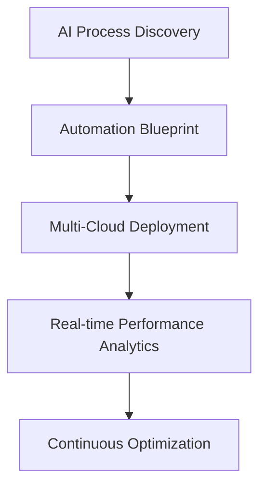

# OneInfosys Technologies | AI-Driven Enterprise Solutions ⚡


[](https://oneinfosys.com)
[](https://onefusion.ai)

#### Legend
✅ Production Ready | ▶ In Beta | 🚧 Active Development | 🔜 Roadmap

## 🛠 Core Architecture (Q3 2025 Roadmap)

```python
class EnterpriseAI:
    """Unified AI Orchestration Framework (v2.8 Preview)"""
    
    def __init__(self):
        self.modules = {
            'automation': ['WorkflowGen', 'TaskForge ▶'],  # Coming Q4
            'analytics': ['InsightMatrix ✅', 'PredictIQ'], 
            'generation': [
                'CodeSynth (Dev Preview)', 
                'MediaFusion 🚧'  # ETA Nov 2025
            ]
        }
    
    def integrate(self):
        return self._architecture_blueprint()
    
    def _architecture_blueprint(self):
        """Next-gen features under active development"""
        return {
            'quantum_ml': '🔒 Phase 3 Testing',
            'neuromorphic_api': '🔜 Q1 2026 Release'
        }
```

## 🛠️ Solutions Matrix

| Domain       | Tech Signature              | AI Components               |
|--------------|-----------------------------|-----------------------------|
| Web 4.0      | React, Next.js, Deno        | AI-Driven UX Optimization   |
| FinTech      | Blockchain, Web3            | FraudGuard AI               |
| HealthTech   | FHIR, IoT Integration       | PatientFlow Analytics       |
| Retail       | AR Commerce, WebGL          | DemandForecast Engine       |

## ⚡ Recent Innovations (2025)



## 🚀 Deployment Quickstart
```bash Soon
# Init OneFusion CLI
npx @oneinfosys/cli init

# Deploy AI Module
onefusion deploy --module workflow-automation
```

## 🔐 Enterprise Security
- Zero-Trust AI Architecture
- Quantum-Resistant Encryption
- SOC2 Type II Certified
- Real-time Threat Detection

## 🌐 Connect
[](mailto:PSupport@oneinfosys.com)  
[API Docs](https://docs.oneinfosys.ai) | [AI Playground](https://lab.oneinfosys.ai) | [Case Studies](https://success.oneinfosys.ai)

```
